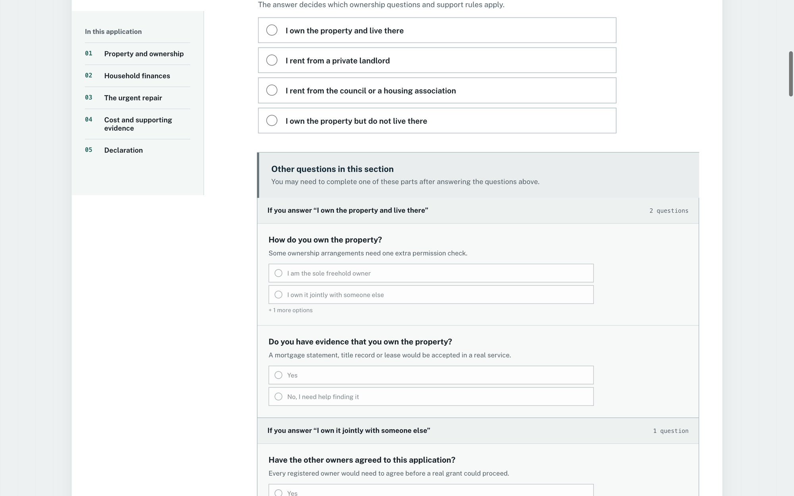
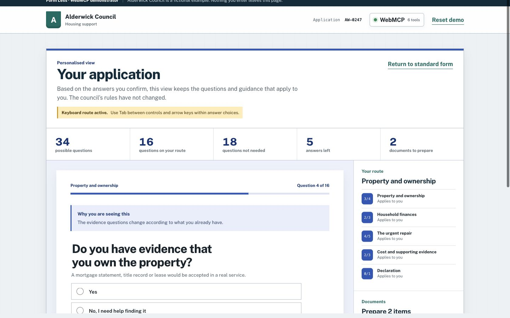
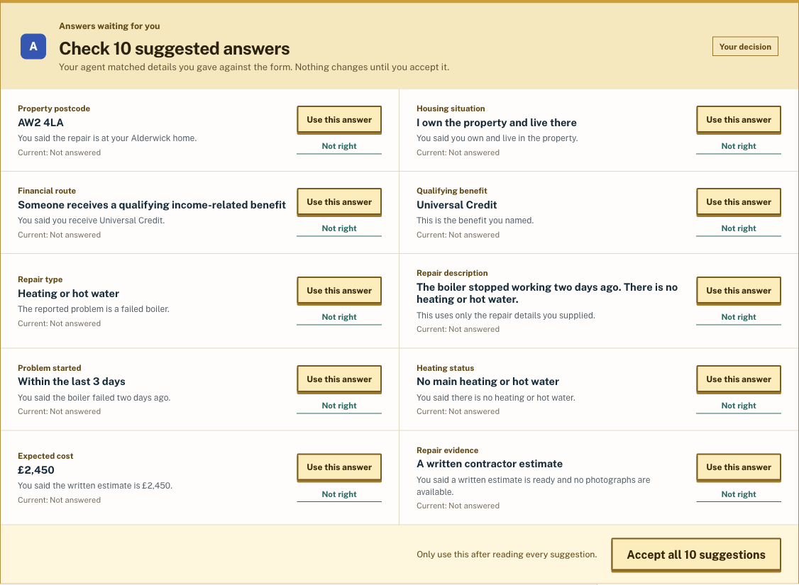

# Form Less

[](https://github.com/fortydegrees/form-less-webmcp/actions/workflows/deploy-pages.yml)

**A WebMCP technology demonstrator built for the [OpenAI WebMCP Hackathon](https://webmcp.devpost.com/). Alderwick Council is the fictional example, not the product.**

**Same service. Less form.**

Form Less shows how a rule-heavy website can expose its own structure and safe
actions through WebMCP, then work with a visitor's agent to produce a smaller,
personal interface. We built the fictional Alderwick Council service so the
idea could be tested end to end on a realistic application rather than a toy
form.

In this example, the site keeps control of its rules, validation and interface.
The applicant keeps control of their answers and the final submission.

[Try the live application](https://fortydegrees.github.io/form-less-webmcp/)

## Before and after

<table>
  <tr>
    <th width="50%">Before: the complete service</th>
    <th width="50%">After: this applicant's route</th>
  </tr>
  <tr>
    <td></td>
    <td></td>
  </tr>
  <tr>
    <td>Five sections covering every ownership, finance, repair and evidence branch.</td>
    <td>Only the relevant questions, with known facts ready for the applicant to review.</td>
  </tr>
</table>

## What the example proves

- **34 possible questions → 16 on the demo route → 18 not needed** once
  the applicant confirms the routing choices.
- **10 answers proposed → 0 stored** until the applicant reviews and accepts
  them.
- **6 WebMCP tools → 0 submission tools.** The agent can inspect, adapt,
  explain, propose, validate and review. It cannot declare or submit.

## Try it with ChatGPT

Use the ChatGPT desktop built-in browser with Site Tools enabled:

1. Open the [live application](https://fortydegrees.github.io/form-less-webmcp/).
2. Open **Site tools → Available site tools** and confirm that six tools are
   listed. The green **WebMCP · 6 tools** button on the page describes their
   roles and confirms that no submission tool exists.
3. Send this in the same chat:

   > Use this site's tools, not browser clicks. I use keyboard navigation. I
   > own and live at AW2 4LA, receive Universal Credit, and my boiler failed two
   > days ago. There is no heating or hot water. I have a £2,450 written
   > estimate but no photos.

4. The site switches from the complete application to its focused layout. Ten
   suggested answers appear, while every current answer remains
   visibly **Not answered**.
5. Review and accept the suggestions in the webpage. The site recalculates the
   pathway and removes branches that do not apply.
6. Ask the agent to validate and review the application. It can return official
   rules and deterministic issues, but it cannot make the declaration or press
   **Submit application**.

The agent only stages facts the applicant has already supplied. Nothing enters
the application until the person accepts each suggestion.



Chrome 146 or later can also expose the tools with **WebMCP for testing**
enabled, although the flag provides the API rather than an agent. The complete
human form still works when Site Tools are unavailable.

## The technology behind the example

Without WebMCP, an agent must repeatedly inspect page content, infer conditional
relationships, track DOM changes and guess which actions have side effects.
Here it gets typed questions, current values, allowed answers, conditions,
site-written explanations and explicit authority boundaries.

The reusable part is the contract and tool layer, not Alderwick's grant policy.
The fictional council rules are sample content plugged into the same pattern a
real service could use for benefits, permits, onboarding or other conditional
workflows.

The same form contract is used by the normal UI, the focused UI, validation and
the WebMCP tools:

- [`src/form.schema.json`](src/form.schema.json) defines the 34 fields, types,
  allowed values, constraints, conditional applicability and agent-write
  boundaries.
- [`src/form.ui.json`](src/form.ui.json) defines the five standard sections and
  the council-approved focused layout.
- [`src/form.rules.json`](src/form.rules.json) contains fictional official
  requirements and cross-field checks.
- [`src/formDefinition.ts`](src/formDefinition.ts) connects those files to the
  standard UI, focused UI, domain engine and WebMCP tools.

See [`docs/architecture.md`](docs/architecture.md) for the state and authority
model.

### The six tools

- `inspect_application` returns the full structured contract and current state.
- `configure_assistance` activates approved presentation preferences without
  changing an answer.
- `propose_answers` stages up to ten schema-valid suggestions for human review.
- `explain_requirement` returns a named site-authored rule and evidence advice.
- `validate_application` runs deterministic schema and service-rule checks.
- `get_application_review` returns the live pathway, answers, issues and the
  explicit human-only submission boundary.

There is no `submit_application` tool. The declaration is excluded from every
agent-writable schema too.

## Run locally

Requirements: a current Node.js installation and pnpm.

```bash
pnpm install
pnpm dev
```

Run the release gates with:

```bash
pnpm test
pnpm lint
pnpm build
```

Pushes to `main` run all three gates before deploying the static build to
GitHub Pages.

## Implementation

- React, TypeScript and Vite.
- Static deployment with no backend, accounts, API keys, uploads or external
  data.
- One canonical application state shared by the visible interface and WebMCP.
- Deterministic applicability, validation, review and submission boundaries in
  [`src/domain.ts`](src/domain.ts).
- Browser-native tool registration in [`src/webmcp.ts`](src/webmcp.ts).
- Vitest coverage for schema integrity, branching, policy rules, proposal
  consent, generated tool schemas and the absent submission capability.

Built with Codex as the implementation partner for the application, tests and
QA. The product idea, applicant scenario, authority boundaries and release
decisions were human-directed. No model or external API runs inside the shipped
site.

Alderwick Council and every policy, applicant detail and reference number in
the demo are fictional. The Alderwick example is not a real application or
source of eligibility advice.

## Licence

MIT — see [`LICENSE`](LICENSE).
