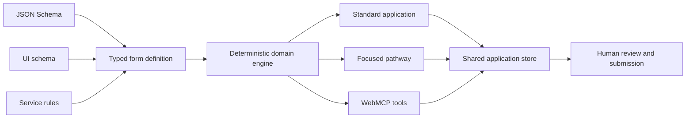

# Architecture

Right Questions uses one service-owned contract to power the ordinary form, a
focused personal pathway, deterministic validation and six WebMCP tools.

## Contract layers

- `src/form.schema.json` defines question types, constraints, allowed values,
  required fields, conditional requirements and agent-write boundaries.
- `src/form.ui.json` groups questions into five standard sections and defines
  the service-approved focused composition.
- `src/form.rules.json` holds fictional official explanations, evidence
  guidance and cross-field checks.
- `src/formDefinition.ts` validates and adapts those files into one typed
  runtime definition.

## Shared state

`src/applicationStore.ts` owns one canonical application state. Both React and
the WebMCP handlers call the same domain operations, so an agent cannot maintain
a hidden parallel form.

`src/domain.ts` owns:

- conditional applicability and pathway calculation;
- draft input and normalized committed answers;
- staged agent proposals and human confirmation;
- schema and cross-field validation;
- application review and the final submission boundary; and
- a visible activity history for tool calls and human decisions.

## Authority model

The six tools have deliberately narrow capabilities:

- **Read:** inspect the contract, explain a requirement, validate and review.
- **Presentation:** activate or leave the approved focused layout.
- **Propose:** stage schema-valid answers supported by applicant-provided facts.

Proposals do not write application answers. A person must accept or reject them
in the page. The applicant declaration is absent from the agent-writable field
enum, and no submission tool is registered. `get_application_review` reports
`availableToAgent: false` for submission.

## Progressive enhancement

WebMCP is an enhancement rather than a dependency. Unsupported browsers retain
the complete human application, deterministic validation, review and fictional
submission flow. The deployed application is static and requires no account,
backend, API key, model call or external data.
